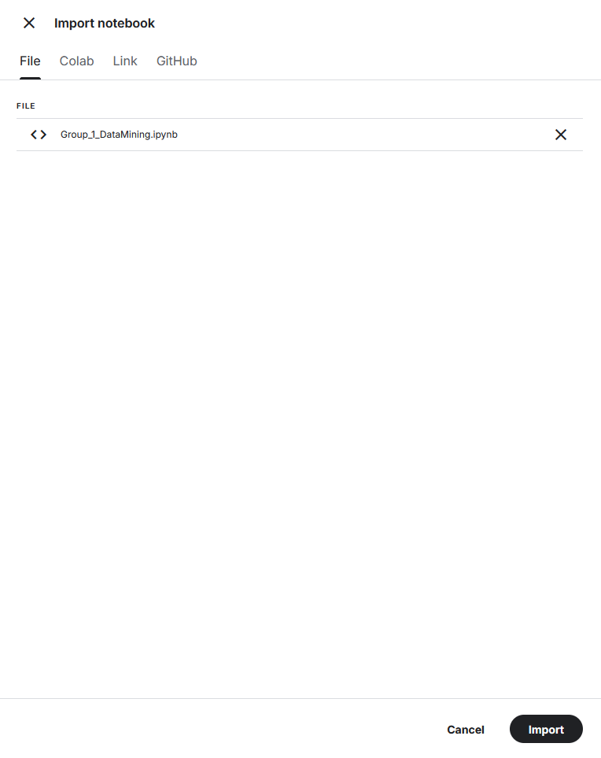

# DSC210 Group 1 Fall '24
## Data Mining Project: Recommendation Systems
### From SVD to BPR and T4Rec 

Group 1:
Joel Polizzi, Antariksha Ray, Lora Khatib, Jemin Vagadia

Examining recommendation systems past and present. We begin with a historical introduction into basic rating systems utilizing Single Value Decomposition of a matrix to provide item ratings, to evaluating a linear algebraic approach of Bayesian Personalized Ranking, and ending with a state-of-the-art approach leveraging Transformers for recommendation. 

We have chosen to use the McAuley-Lab/Amazon-Reviews-2023 dataset focusing the Musical Instruments subset. The dataset set is loaded from HuggingFace.

The repo contains all our final project material including our Project Report Latex and PDF, our slides, and our jupyter notebook containing the coding portions of the project.

## Table of Contents
- [Coding: Notebook Instructions](#coding-notebook-instructions)
- [Project Report](#project-report)
- [Slides](#Slides)
- [Rehearsal Feedback](#rehearsal-feedback)

## Coding: Notebook Instructions
In order to run our notebook the following requirements must be met:
- Verified Kaggle Account with P100 GPU

We are leveraging Kaggle for two key resons. 
1) Ability to easily connect the notebook
2) Free access with GPU availability. **NOTE**: GPU is free on Kaggle *** for 30 hours***. You will need to have GPU access to run out notebook. 

_This notebook was tested using the free P100 GPU Runtime in Kaggle. Please use the P100 GPU Runtime._

#### Step 1: Clone the repository (Group_1_DataMining.ipynb is the notebook to upload to Kaggle)

#### Step 2: Navigate to Kaggle
Select Sign In or Register for an account if you do not have one
Navigate to Kaggle: 

#### Step 3: Sign in if you have already registered and account
Sign in with your preferred method. I used Google. 
  

Choose the account you wish to use 
  

#### Step 4: Ensure you have verified your account with Phone Verification - REQUIRED FOR GPU ACCESS
Navigate tou your settings by clicking on the "Goose Head" icon in the upper right hand corner
 
Select settings: 
 
Scroll to Phone Verification and follow the instructions. You will recieve a text verification code.  
 
 

_Access to GPU may take several minutes, we can now move to loading our notebook then enabling GPU_

#### Step 5: Create "New" Notebook
Navigate back to your front page and in the left hand pane select "Create" then in the drop down select "New Notebook"  

#### Step 6: Load the notebook that you downloaded in Step 1
In the upper left open the File menu and select "Import Notebook"  
  

In the upload window select "Browse Files" 
 

From the cloned repo import the Group_1_DataMining.ipynb notebook into Kaggle  
 

#### Step 6: Enable GPU and Internet
Now that you have verified your phone and have imported the notebook you can enable the GPU accelerator  
In the top left menu select "Settings" and Open "Accelerator". Select GPU P100  
 

Now, turn on Internet as well in order to download the required pip packages. If the pip fails to update with name resolution errors then double check that internet is turned on in the settings. 
 

#### We are now ready to run the notebook!

#### Step 7: Sequentially Run The Notebook Cells
Run the notebook cells in order to get each cells output.

#### Step 8: To run the full BERT4Rec model, make sure to upload the corresponding `Amazon.inter` and `Amazon.item` atomic files, and the `Amazon.yaml` configuration file.
In the notebook we clone the repository into the workspace. We will use these files for uploading as a new dataset. 

In the Kaggle notebook, this needs to be uploaded as a dataset similar to creating the notebook. Navigate back to your front page and in the left hand pane select "Create" then in the drop down select "New Dataset". It is recommended to upload the necessary files as a zip. 
Then, import the dataset into the notebook. Your dataset inside the notebook should look as the picture below (here, "amazon-input" is the dataset name). 
 
If using Google colab or local environment, please ensure to setup the dataset directory structure as per the [official guide](https://recbole.io/docs/v0.1.2/user_guide/usage/running_new_dataset.html) for the config to work correctly.
We have provided two sets of atomic files in the repository.
- `/DSC210-group_proj/Amazon` contains a smaller version of the dataset that caps out the Kaggle notebook GPU memory limits.
- The [link](https://drive.google.com/drive/folders/1b3F9FOi8X8BqUUZ0E2Aii4Ud8kEZvQbP) to the Google Drive contains the full dataset (>100 MB) that can be used if superior hardware and compute power is available. Please visit the link and download the `Amazon_Musical_Instruments.zip` and rename the downloaded `.inter` and `.item` files as `Amazon.inter` and `Amazon.item`.

**For convience, in the first two cells of our notebook we are handeling the installation of python-pip dependencies for our project.**
- You may see Pip deps fail to resolve. The "error" can be ignored as it does not affect our notebooks run
- Cells should be ran sequentially
- Run the cells to get the outputs!

## Results
| Model | Precision@10 | NDCG@10 |
|----------|----------|----------|
| BPR | 0.524 | 0.377 | 
| BERT4Rec (smaller dataset) | 0.0024 | 0.0118 |

The above result for the transformer model is obtained on a substantially smaller version of the dataset, which only needs 16GB of GPU memory. The performance of the transformer model is exponentially better on the full dataset.

## Project Report
Project report Latex and PDF can be found [HERE](./DSC210_Project_Report).

## Slides
Slides can be found [HERE](./slides)

## Rehearsal Feedback
Rehearsal feedback can be found [HERE](./rehearsal)
