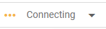

# DSC210 Group 1 Fall '24
## Data Mining Project: Recommendation Systems
### From SVD to BPR and T4Rec 

Group 1:
Joel Polizzi, Antariksha Ray, Lora Khatib, Jemin Vagadia

Examining recommendation systems past and present. We begin with a historical introduction into basic rating systems utilizing Single Value Decomposition of a matrix to provide item ratings, to evaluating a modern linear approach of Bayesian Personalizating Ranking, and ending with a State-of-the-art approach leveraging Transformers for recommendation. 

We have chosen to use the McAuley-Lab/Amazon-Reviews-2023 dataset focusing the Musical Instruments subset. The dataset set is loaded from HuggingFace.

The repo contains all our final project material including our Project Report Latex and PDF, our slides, and our jupyter notebook containing the coding portions of the project.

## Table of Contents
- [Coding: Notebook Instructions](#coding-notebook-instructions)
- [Project Report](#project-report)
- [Slides](#Slides)

## Coding: Notebook Instructions
In order to run our notebook the following requirements must be met:
- Google Colab Account and access to a T4 GPU

We are leveraging Colab for two key resons. 
1) Ability to connect a github repository notebook
2) Free access with GPU availability. **NOTE**: GPU is free on Google Colab as ***availability permits***. You will need to have GPU access to run out notebook in a reasonable amount of time.

_This notebook was tested using the free T4 GPU Runtime in google colab. Though colab offers A100 and L4 cards under paid accounts however our project was not run under these environments. Please use the T4 GPU Runtime._

#### Step 1: Navigate to Colab
Navigate to google colab: [https://colab.research.google.com](https://colab.research.google.com)

#### Step 2: Open the github repository directly from Colab
When You navigate to Google Colab you will be prompted to open a notebook. On the left hand side there is a link to open from Github. You will need to enter in our github URL into the search field: https://github.com/joelpolizzi/DSC210-group_proj

#### Step 3: Select the Group_1_DataMining.ipynb
Select the Group_1_DataMining.ipynb notebook and the project will open

#### Step 4: Select the T4 GPU Runtime
- In the upper right hand corner we will change the runtime. If the runtime states "T4" then you can skip to [Step 5](#step-5-sequentially-run-the-notebook-cells)  
   
- To change the runtime open the "Connect" dropdown Menu:  
   
- Select "Change Runtime Type" and select "T4 GPU". Make sure you Save.  
  
- Then Select "Connect" and the Runtime will connect to the T4 GPU Runtime.  
  
- In the upper right hand side you should now see a green check mark with "T4"  
  

#### Step 5: Sequentially Run The Notebook Cells

**For convience, in the first two cells of our notebook we are handeling the installation of python-pip dependencies for our project.**
- Outputs in our cells have been pre-run. When a cell is re-run the outputs will be re-written.
- Cells should be ran sequentially

## Project Report
Project report Latex and PDF can be found [HERE](./DSC210_Project_Report).

## Slides
test
test
test
